## INSTALACIÓN

##Cómo instalar New Reset A.I.H.D. en Windows

###XAMPP

El XAMPP gestionará Apache2, PHP, MySQL y PHPMyAdmin en su servidor.

Es un kit de herramientas que hace su trabajo mucho más fácil.

* Instale la aplicación XAMPP en su servidor. Vaya a este sitio abajo y haga clic [esta página](https://www.apachefriends.org/index.html)  en XAMPP para Windows.

* Descargue el instalador y ejecútelo

* Sigue las capturas de pantalla de abajo:

  ​


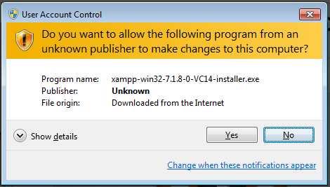

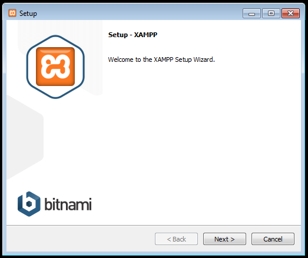

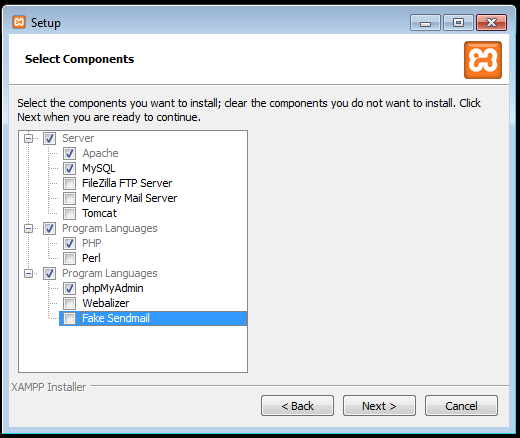

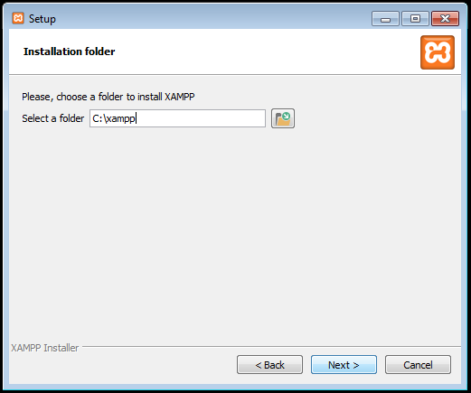

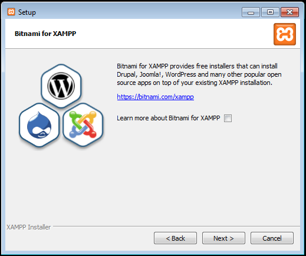

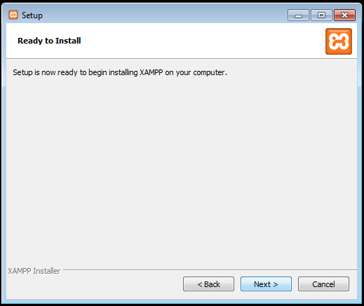

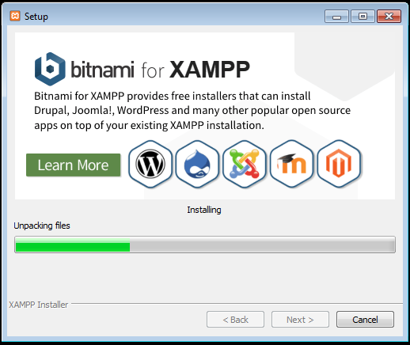

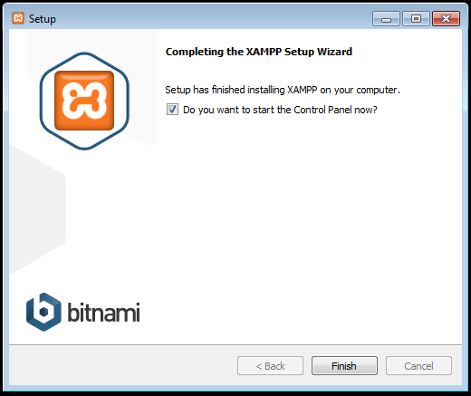

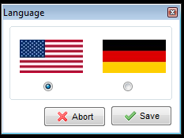


* Una vez finalizada la instalación, abra el Panel de Control XAMPP y haga clic en los botones `Start` en Apache y MySQL.
* Ahora, haga clic en `Admin` en MySQL. Será redirigido a PHPMyAdmin.
* Haga clic en la pestaña `SQL`, rellene con los siguientes comandos y pulse `Continuar`.
```sql
CREATE USER 'xxNameUserxx'@'localhost' IDENTIFIED BY 'choose_a_password!';
CREATE DATABASE xxNameDBxx;
GRANT ALL PRIVILEGES ON xxNameUserxx.* to xxNameDBxx@localhost;
```


###Git

Git se utilizará para descargar el proyecto.
* Instalar Git ir a [este enlace](https://git-scm.com/download/win) y descargar la última versión de software.

* Sigue las capturas de pantalla de abajo:


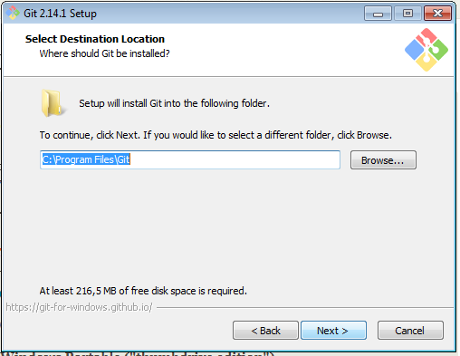

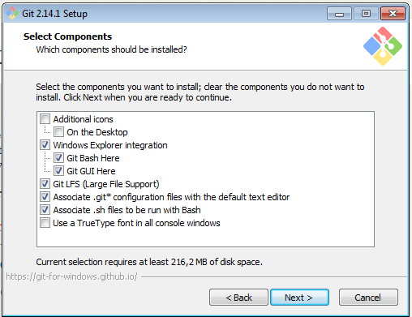

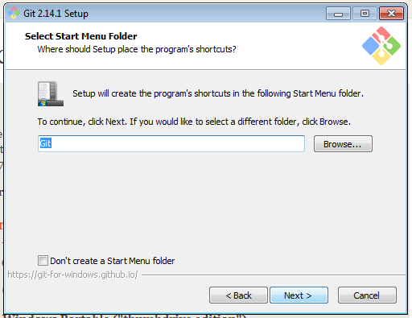

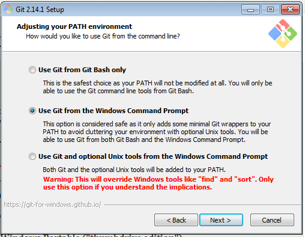

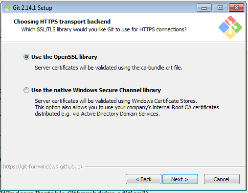

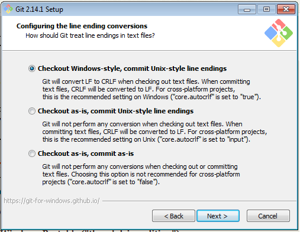

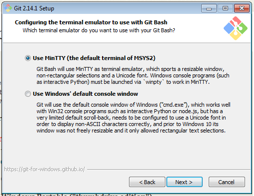

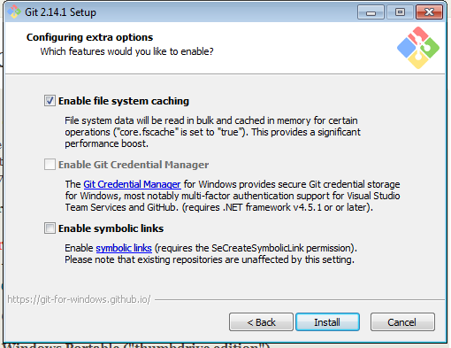


###Composer

* Haz un clic derecho en el escritorio y elige Abrir "Git Bash Here".
* Ejecutar los comandos siguientes:

```
cd c:/xampp/php

./php.exe -r "copy('https://getcomposer.org/installer', 'composer-setup.php');"
./php.exe -r "if (hash_file('SHA384', 'composer-setup.php') === '544e09ee996cdf60ece3804abc52599c22b1f40f4323403c44d44fdfdd586475ca9813a858088ffbc1f233e9b180f061') { echo 'Installer verified'; } else { echo 'Installer corrupt'; unlink('composer-setup.php'); } echo PHP_EOL;"
./php.exe composer-setup.php
./php.exe -r "unlink('composer-setup.php');"
```

//

###wkhtmltopdf

* Acceder al enlace https://wkhtmltopdf.org/downloads.html y descargue la última versión según su sistema operativo.

* Ejecutar el asistente de instalación y terminar el proceso.


##Descarga el instalador de sistema New Reset A.I.H.D.

Hay dos modos para se instalar el sistema:

* con versionamiento (git);

* sin versionamento (zip).

#### Instalación a través de cliente *GIT* (versionamiento)

Ese es el modo preferible para se instalar el sistema, porque se permite actualizar el aplicativo en modo simple y seguro, y también manteniendo las personalizaciones privadas, configuraciones generales del sistema etc.

Para instalar el sistema por el cliente del *GIT*, escriba en la linea de comandos de *Linux*- bajo el directorio donde se desea instalar el paquete - el comando abajo:

	git clone git://github.com/andgar2010/Project_New_Reset_AIHD.git

#### Instalación por paquete zip

Para descargar la última versión del sistema New Reset A.H.I.D. acceda el enlace

```
https://github.com/andgar2010/Project_New_Reset_AIHD
```

y haga un clic en el icono “Download ZIP” que se encuentra al lado derecho de la página.


​								    Figura 1 - Icono para *Download*

Después del clic el sitio de GitHub proporcionará el paquete de la última versión para ser guardado en su computadora.


​					     Figura 2 - Download del New Reset A.H.I.D. en formato *ZIP*

Todo el contenido del archivo deberá ser despaquetado - se recomienda utilizar el aplicativo *Bandizip* o *7-ZIP* en *Windows* - y después transportar al servidor web que alojará el sistema.


​								Figura 3 - Estructura de archivos

Se recomienda el envio de los archivos por *FTP* o utilizar la instalación del sistema en directo a través del software del *GitHub* para servidores *Linux*.

### Crear una base de datos en el servidor *MySQL*

Crea una base de datos en el servidor *MySQL* con el nombre de *'xxNameDBxx'* - o el nombre que mejor se adapta al servidor instalado o a los criterios de seguridad de la institución. Los datos de ejemplo en seguida serán necesarios para la conexión:

| Requisito 	 | Valor (ejemplo) 	|
| :------------- | :--------------- |
| Servidor		 | localhost	   	|
| Base de datos  | xxNameDBxx	   	|
| Usuario 		 | sa\_xxNameUserxx |
| Contraseña 	 | \*\*\*\*\*\* 	|
| Servidor de BD | MySQL 			|

Este archivo solamente será creado una vez. Cualquier cambio en los parámetros del sistema, el archivo de configuración deberá ser borrado del sistema por el administrador técnico a través del *FTP*.

El archivo de configuración es creado en el directorio *_db* bajo el directorio raíz del sistema.

### Activación de la conexión con la base de datos

En el primero acceso del sistema es necesario tener las configuraciones del archivo de conexión con la base de datos. Para que eso pueda occurir, se accede el sistema en su página de instalación a través de cualquier navegador de internet, ej:

```
htttp://localhost:8080/
```

Si el archivo *_db/db_paho.php* no es localizado, el sistema redirecciona para el area de configuración, presentando la pantalla de la figura 4.


Figura 4 - Pantalla de configuración _db archivo *DB*

En esa pantalla se debe informar el tipo de base de datos *(Base Type)*, con una de las opciones:

* *MySQL* para se conectar a la base de datos *MySQL* a través del método *mysql_connect()* , común en na mayoría de los servidores.

* *MySQL (PDO)* para acceder la base de datos MySQL utilizando un driver con interfaz PHP Data Objects (PDO). Esa función es utilizada cuando el servidor informa que el método mysql_connect() es obsoleto.

En el campo *Database host* se debe informar el *IP* o el nombre del servidor de la base de datos. Se puede utilizar *localhost* cuando la base se encuentra en el mismo servidor.

Los otros campos se refieren a la conexión con la base de datos, como el nombre de la base *(Database name)*, usuario de conexión *(User name)* y la contraseña *(Password)*. En caso de error, el sistema informa en una caja de texto abajo los problema encuentrados. Si todo estuvier configurado correctamente, el archivo *_db\paho.php* es creado automáticamente, informando el mensaje de éxito.

### Creación manual del archivo de acceso a la base de datos

Se puede optar por crear el archivo *_db/db_paho.php* manualmente, el caso que no se desea habilitar permisos de escritura para el usuario del *Apache* en esta carpeta. Si es así, se debe crear el archivo con el contenido abajo, personalizado para cada servidor. Se debe guardar ese archivo en el subdirectorio *_db* con el nombre *db/paho.php*.


© 2018 New Reset A.I.H.D., Inc.
